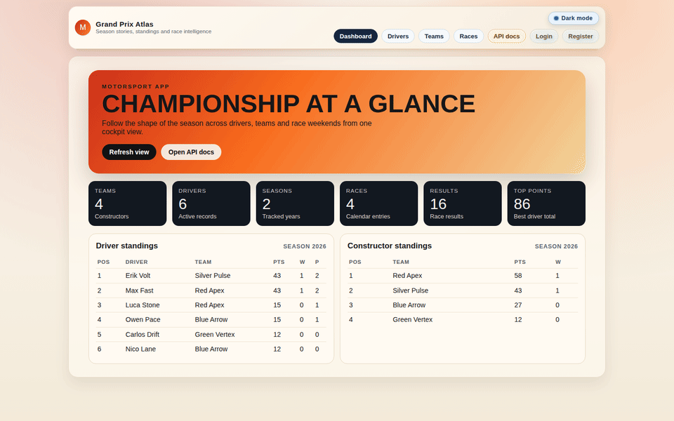
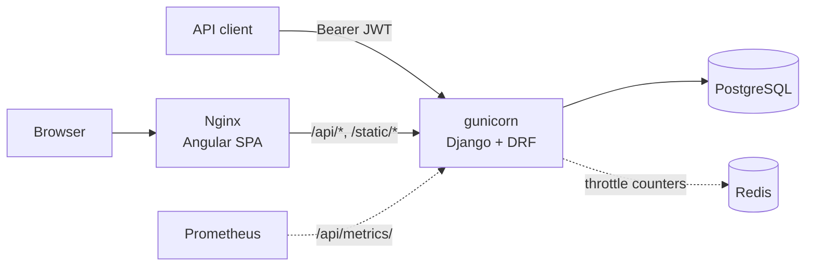
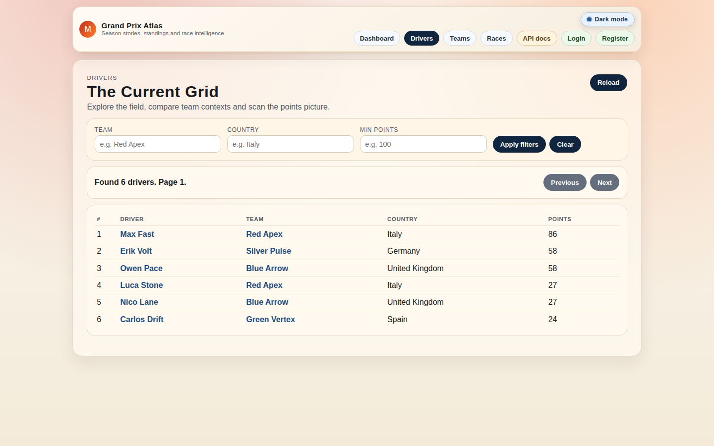
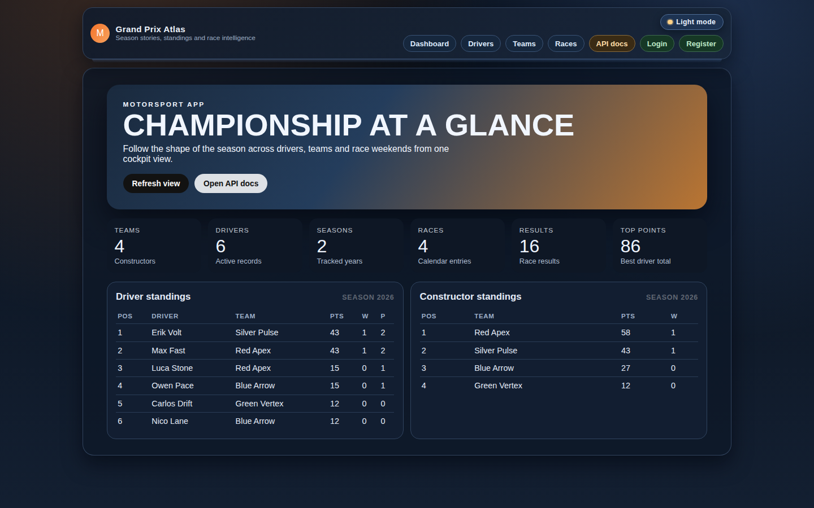
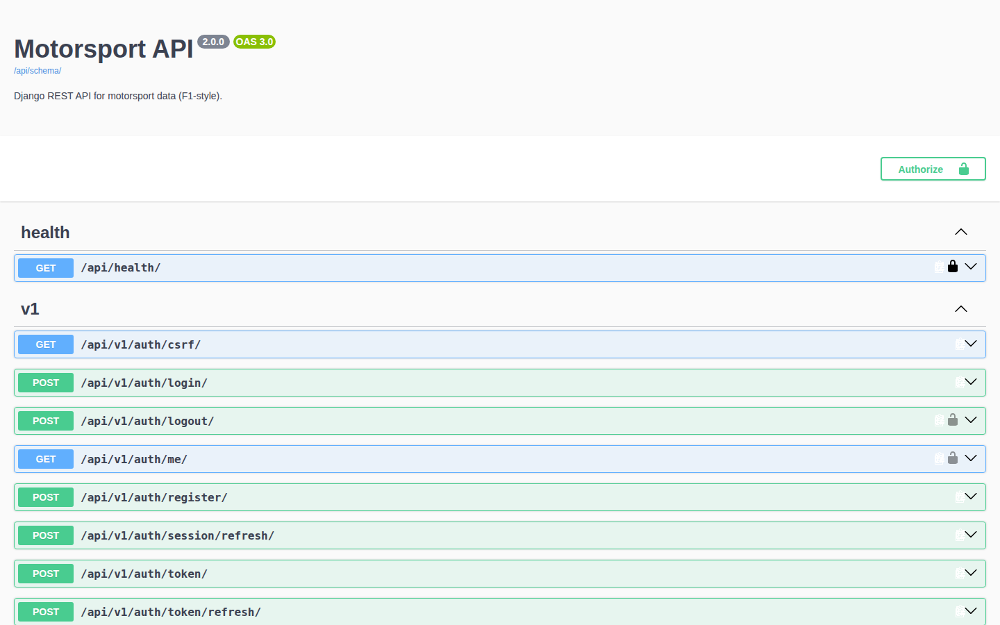

# Motorsport API

A Django REST API for a fictional motorsport championship (teams, drivers, seasons, races, results) with computed standings, cookie- or token-based JWT auth and an Angular dashboard on top.

[](https://github.com/MaciejZiel/Motorsport_API/actions/workflows/ci.yml)
[](LICENSE)


Live demo: coming soon — deploy with the button below

[](https://render.com/deploy?repo=https://github.com/MaciejZiel/Motorsport_API)



## What it does

- **CRUD API (`/api/v1/`)** for teams, drivers, seasons, races and race results, with filtering, pagination and database constraints (one result per driver per race, unique positions, one fastest lap per race).
- **Standings and stats**: driver and constructor standings per season (points, wins, podiums) are computed with SQL aggregation; `/api/v1/stats/` summarises the whole dataset.
- **Two ways to authenticate**: browser sessions get JWTs in `HttpOnly` cookies with CSRF protection; API clients use classic Bearer tokens. Refresh tokens rotate and are blacklisted on logout. Reads are public, writes need a staff account.
- **Production plumbing**: OpenAPI docs (Swagger UI / ReDoc), health check, Prometheus metrics, `X-Request-ID` tracing in responses and logs, throttling, a strict Content-Security-Policy and env-driven HTTPS settings.
- **Angular 21 frontend** (dashboard, drivers, teams, races, login/register, dark mode) served by Nginx, which proxies `/api/` to Django.

## Architecture


```mermaid
flowchart LR
    B[Browser] --> N["Nginx<br/>Angular SPA"]
    C[API client] -->|Bearer JWT| G
    N -->|"/api/*, /static/*"| G["gunicorn<br/>Django + DRF"]
    G --> P[(PostgreSQL)]
    G -.->|throttle counters| R[(Redis)]
    M[Prometheus] -.->|/api/metrics/| G
```

Without `DATABASE_URL` / `DJANGO_DB_ENGINE` the API falls back to SQLite, and without `DJANGO_CACHE_URL` to an in-process cache, so it also runs as a single process with no services.

## Tech stack

- **Backend:** Python 3.12, Django 6, Django REST Framework, SimpleJWT, drf-spectacular, gunicorn, WhiteNoise
- **Data:** PostgreSQL 16 (SQLite for local dev), Redis (shared cache for throttling)
- **Frontend:** Angular 21, TypeScript, Vitest, served by Nginx
- **Ops:** Docker Compose, GitHub Actions (CI + image publishing to GHCR), Prometheus rules, Render Blueprint

## Quick start

**Option A: Docker** (PostgreSQL, Redis, API and frontend):

```bash
docker compose up --build
docker compose exec api python manage.py seed_motorsport   # sample data
```

- Frontend: http://127.0.0.1:4200
- API + Swagger UI: http://127.0.0.1:8000 (redirects to `/api/docs/`)

Compose publishes ports 5432, 6379, 8000 and 4200, so stop anything already using them.

**Option B: local Python** (SQLite, no services):

```bash
python -m venv .venv
source .venv/bin/activate          # Windows: .venv\Scripts\activate
pip install -r requirements.lock   # pinned versions, same as CI and Docker
python manage.py migrate
python manage.py seed_motorsport   # 4 teams, 6 drivers, 2 seasons, 4 races, 16 results
python manage.py createsuperuser   # optional: a staff account can write
python manage.py runserver
```

Then open http://127.0.0.1:8000/api/docs/. To run the Angular app against it (Node.js 24 LTS):

```bash
npm --prefix frontend install
npm --prefix frontend run start    # http://localhost:4200, proxies /api to :8000
```

## Tests

```bash
pytest --cov=Motorsport_API --cov=racing --cov-config=.coveragerc   # backend
npm --prefix frontend run test:ci                                     # frontend
bash scripts/e2e_compose_smoke.sh                                     # full stack in Docker
```

- **Backend:** 103 pytest tests (unit + API integration), 93% line coverage. CI fails below 90%.
- **Frontend:** 61 Vitest tests in 16 files. CI enforces a minimum line coverage of 66%.
- **CI** also runs ruff, `pip-audit`, `npm audit`, a missing-migrations check, `manage.py check --deploy` with production settings, a frontend build and a Docker Compose smoke test that registers, logs in and logs out through the frontend proxy and checks that the API docs assets load.

## Key technical decisions

- **JWT in `HttpOnly` cookies for the SPA, Bearer tokens for scripts.** Tokens in `localStorage` can be read by any XSS payload; cookies cannot, but they bring CSRF back. So unsafe cookie-authenticated requests require a CSRF token (`/api/v1/auth/csrf/`), while `/auth/token/` stays available for clients that are not browsers.
- **Standings are aggregated on read, driver points are denormalised.** Season standings come from one `GROUP BY` query (`Sum` plus conditional `Count` for wins and podiums), so they cannot drift from the results. `Driver.points` is a stored total kept in sync whenever a result is saved or deleted, which keeps the drivers list cheap to filter and sort.
- **A strict CSP by default.** `script-src 'self'` blocks the CDN-hosted Swagger UI that drf-spectacular uses by default, so the docs assets are bundled (`drf-spectacular-sidecar`) and the Swagger init script is loaded as a separate same-origin file instead of being inlined.
- **Simple in-process metrics.** `/api/metrics/` is a small Prometheus exporter without the `prometheus_client` multiprocess setup. The cost is that gunicorn runs one worker by default so the counters stay consistent. That is fine for this load, but it is the first thing to change when scaling out.

## Deploying

`render.yaml` is a [Render Blueprint](https://render.com/docs/blueprint-spec) for a free demo: the API runs from the existing `Dockerfile`, with a managed PostgreSQL database. On every start, `scripts/render_start.sh` runs migrations, seeds the sample data and a read-only demo user (both idempotent), then starts gunicorn on Render's `$PORT`. The free plan has no pre-deploy hook, which is why this happens at start-up.

What you need to click:

1. Click **Deploy to Render** above and sign in to Render with GitHub. If asked, give Render access to this repository.
2. Render shows the Blueprint with two resources, the web service `motorsport-api` and the database `motorsport-db`, both on the free plan. Enter any Blueprint name and click **Deploy Blueprint**. You don't need to enter any values: secrets are generated and `DATABASE_URL` is wired up automatically.
3. Wait for the first build (a few minutes), then open the service URL shown in the dashboard (`https://motorsport-api-xxxx.onrender.com`). It redirects to Swagger UI, and `/api/health/` should return `{"status": "ok", ...}`.
4. Replace the "Live demo" line at the top of this README with that URL.

Demo login (works in Swagger UI's `POST /api/v1/auth/token/` or the cookie login): user `demo`, password `motorsport-demo`. The account is deliberately public. It is not staff, so every write returns `403`. To use another password, change `DEMO_USER_PASSWORD` under **Environment** in the Render dashboard. The next start resets the account to that value.

What the Blueprint sets: `DJANGO_ENV=production` (HTTPS redirect, secure cookies, HSTS for 1 hour). It also sets two generated secret halves, which are joined into an 88-character `DJANGO_SECRET_KEY` because Render's generated values are 44 characters and the production check requires 50. The service trusts `RENDER_EXTERNAL_HOSTNAME` for `ALLOWED_HOSTS`/CSRF, and the health check is exempt from the HTTPS redirect so it hits the real database check.

Self-hosted production (GHCR images, Compose, rollback, backups, monitoring) is documented in [docs/operations.md](docs/operations.md) and [docs/runbooks/production-deployment.md](docs/runbooks/production-deployment.md).

## Screenshots

| Dashboard | Drivers |
| --- | --- |
|  |  |
| **Dark mode** | **Swagger UI** |
|  |  |

## Limitations and next steps

- The data is fictional sample data. There is no import from a real timing or results feed.
- The Render Blueprint deploys only the API (with Swagger UI as its landing page). The Angular frontend is not part of it yet.
- On Render there is no Nginx in front of Django, so `/api/metrics/` is publicly readable there. It should be restricted (an allow-list or a token) before anything beyond a demo.
- Metrics are process-local (see above), so scaling gunicorn workers needs `prometheus_client` multiprocess mode or a push gateway.
- Render's free tier puts the service to sleep when idle, so the first request after a pause is slow. Free PostgreSQL instances also have a limited lifetime (see Render's pricing docs).
- With `SEED_DEMO_DATA=true`, every restart restores the sample rows to their seeded values. Set it to `false` once you want to keep your own edits.

## License

Released under the [MIT License](LICENSE). Third-party components added to the repository are listed in [3rdparty_licenses.md](3rdparty_licenses.md).
